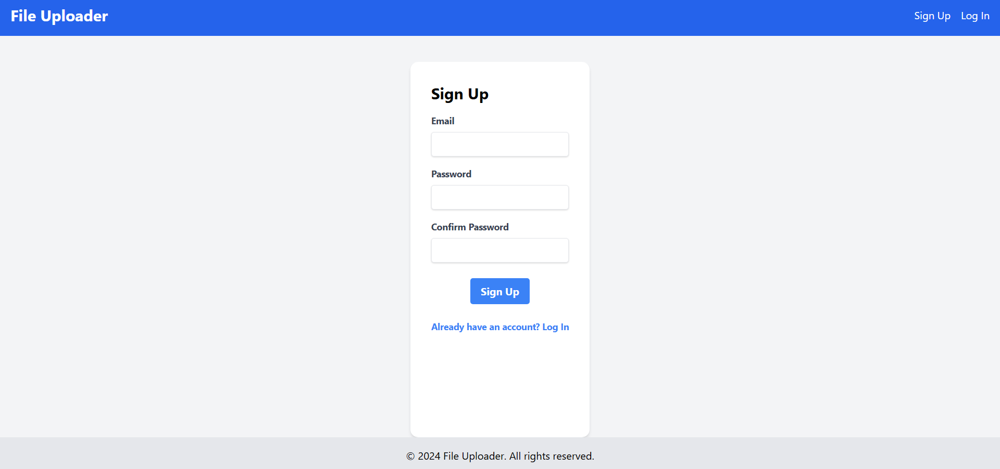
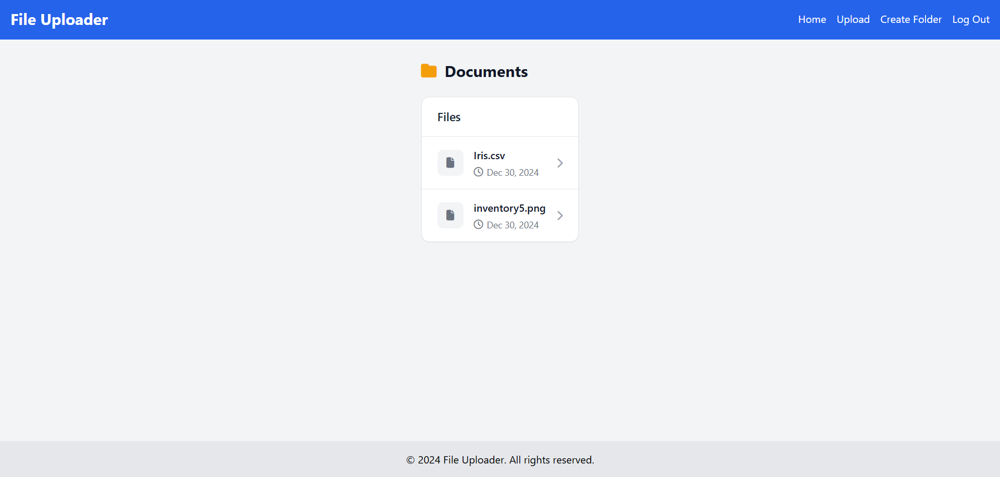
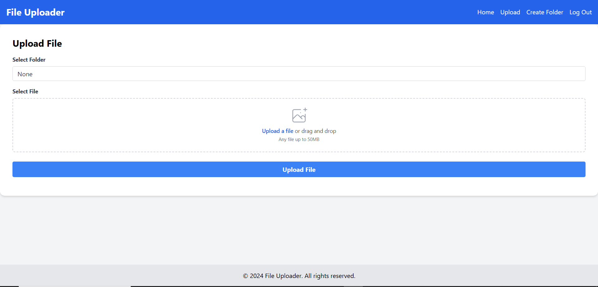

# 💾 Drive

A drive web app where users can manage and upload their files.
Files get stored in a cloud storage service
in our case **Supabase** was integrated.

Check it out at https://due-nora-yassin-prog-1916f3b8.koyeb.app/

## 📸 Screenshots

    
    
    
    

